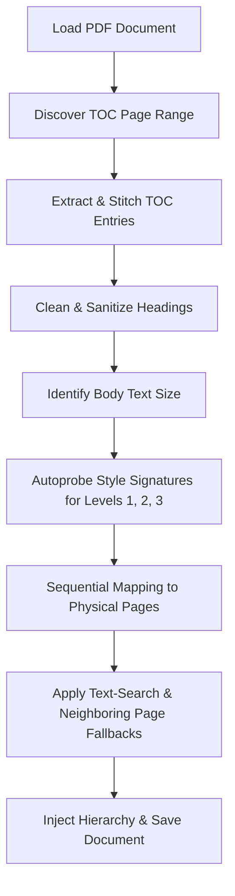

# 📚 Auto PDF Bookmarker Suite

A high-performance, intelligent Python suite designed to automatically parse, resolve, and inject hierarchical Table of Contents (bookmarks) into PDF textbooks and documents. Powered by **PyMuPDF**, this suite shifts away from fragile, hardcoded regex parsers to leverage physical layout metrics, dynamic font-size analysis, and automatic style-signature discovery.

---

## 🚀 The Bookmark Suite At A Glance

The project has evolved from a basic font-measuring script into a robust multi-tool suite to handle any PDF bookmarker scenario:

| Script | Purpose | Complexity | Ideal Use Case |
| :--- | :--- | :--- | :--- |
| **`universal_bookmarker.py`** | **Universal Plug-and-Play Bookmarker** | High (Autonomous) | The flagship tool. Automatically discovers TOC, autoprobes heading styling signatures, maps pages sequentially, and bookmarks any standard book dynamically. |
| **`add_dsa_bookmarks.py`** | **Specialized Sequential Bookmarker** | Medium (Hybrid) | Custom-tailored for Data Structures & Algorithms (DSA) textbooks with complex headers and font encoding anomalies (e.g., Unicode glyph remapping). |
| **`add_bookmarks.py`** | **Basic Physical Bookmarker** | Low (Manual Config) | Simple textbook layout bookmarking using manual font-size threshold matching. |
| **`inspect_fonts.py`** | **Font Size & Style Inspector** | Utility | Probes and prints the physical sizes and font families of text blocks on target pages to help manually configure thresholds. |

---

## 🌟 Key Features of the Universal Bookmarker

Our flagship `universal_bookmarker.py` tool is designed as a zero-config, plug-and-play solution that does all the heavy lifting autonomously:

- 🔍 **Automated TOC Discovery**: Intelligently scans the beginning of the PDF to identify where the Table of Contents begins and ends by analyzing keyword patterns and structural heading density.
- 🧵 **Smart Line Stitching (Multiline Support)**: Automatically joins headings that were split across multiple line breaks in the PDF text flow (e.g., merging a section number `"1.1"` with its title `"Introduction"` on the next line).
- 🧹 **TOC Sanitization**: Cleans dot leaders (e.g., `...`, `· · ·`), trailing page numbers, and extra whitespaces to generate neat, professional bookmark titles.
- 📐 **Dynamic Style Autoprobing**:
  1. Identifies the document's standard **body text size** (using the statistical mode of text block sizes from the center of the book).
  2. Automatically searches content pages for the first few outline headings to determine their **exact physical font size and font family** (style signatures) for Level 1 (Chapters), Level 2 (Sections), and Level 3 (Sub-sections).
- 🗺️ **Sequential & Multi-Phase Mapping**:
  - Matches outline headings sequentially to physical pages.
  - Resolves Chapter pages dynamically based on the location of their first child section (e.g., Chapter 5 starts where section 5.1 is found).
- 🛡️ **Robust Fallback Engine**: If a heading's styling signatures cannot be visually found, the bookmarker falls back to an exact text-based search, and if that also fails, it relies on a sequential offset relative to neighboring sections to ensure a correct bookmark hierarchy.
- 🔠 **Font Glyph Remapping**: Corrects common PDF font rendering anomalies (e.g., automatically remapping the font artifact `"Omega-Q"` back to the proper Greek symbol `"Omega-Ω"`).

---

## 🛠️ Installation

The suite requires Python 3.8+ and **PyMuPDF** (`fitz`), which provides lightning-fast PDF parsing and modification.

```bash
pip install PyMuPDF
```

---

## 📖 Detailed Usage Guide

### 1. Universal Bookmarker (`universal_bookmarker.py`)

This tool can be run in two modes: **Command Line Interface (CLI)** or **Interactive Wizard**.

#### 💻 CLI Mode
Run the script passing the input PDF as an argument. The output PDF path is optional and defaults to `<input_file>_bookmarked.pdf`.

```bash
# Basic usage (saves as my_textbook_bookmarked.pdf)
python universal_bookmarker.py my_textbook.pdf

# Custom output destination
python universal_bookmarker.py my_textbook.pdf output_folder/my_bookmarked_textbook.pdf
```

#### 🧙 Interactive Wizard Mode
If run without any arguments, the script will launch a friendly terminal wizard asking you for the file paths:

```bash
python universal_bookmarker.py
```
*Prompt output:*
```text
Enter the path to the input PDF: C:\path\to\textbook.pdf
Enter the path for the bookmarked output PDF (leave empty for default): 
```

---

### 2. Specialized DSA Bookmarker (`add_dsa_bookmarks.py`)
Custom-built for highly specific DSA structures. It parses the TOC from pages 7 to 14, resolves section numbers (`X.Y` in bold, ~9.81 pt) sequentially, maps Preface and Acknowledgements, and correctly outputs the file.

```bash
python add_dsa_bookmarks.py
```
*(Note: To use this, open the script and update the `input_file` and `output_file` paths at the bottom of the script).*

---

### 3. Font Inspector (`inspect_fonts.py`)
If you ever need to manually configure font size thresholds for `add_bookmarks.py`, you can use `inspect_fonts.py` to examine the document's structure:

1. Open `inspect_fonts.py` and modify the PDF filename on line 3 and page numbers on line 5.
2. Run the script:
   ```bash
   python inspect_fonts.py
   ```
3. Use the output sizes to update the rules in `add_bookmarks.py`.

---

## ⚙️ Technical Architecture & Pipeline

The `universal_bookmarker.py` uses a multi-stage compilation pipeline:



### 🧠 How Autoprobing Works
Instead of using complex configuration files or ML models, the bookmarker utilizes **dynamic calibration**:
1. It analyzes the statistical mode of text blocks across the middle 5 pages of the document to establish a base **Body Size (B)**.
2. It takes the first 5 headings of each level (Chapter, Section, Subsection) from the parsed TOC.
3. It scans the document sequentially to locate where these headings first appear in the main text flow.
4. When a heading is found, it extracts and registers its `size` and `font` name as the document's **Style Signature** for that outline level.
5. All subsequent headings are mapped by comparing their layout properties against this dynamic signature.

---

## 🤝 Contributing

Contributions to improve style discovery algorithms, handle more edge cases, or add graphical user interfaces (GUIs) are welcome! Feel free to open a Pull Request or issue.
